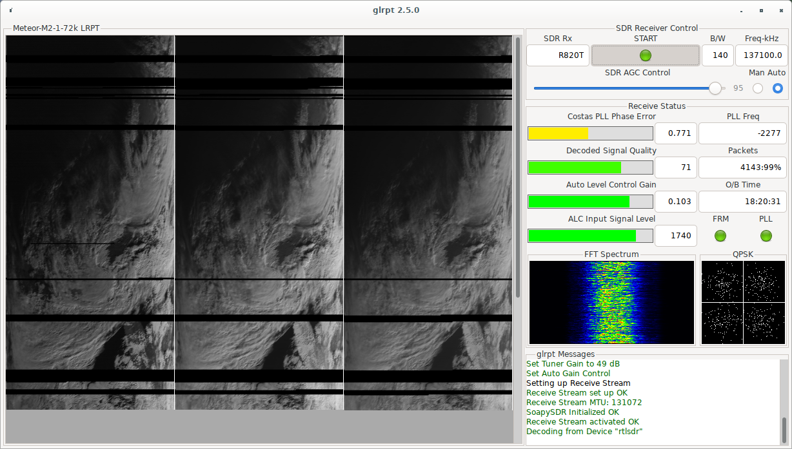

# glrpt
Originally developed by [Neoklis Kyriazis](http://www.5b4az.org/), `glrpt` provides all-in-one solution to receive, demodulate and decode LRPT images on Linux without tinkering with audio pipes and 3rd-party software as with SDR# and LRPT-decoder.



## Requirements

### Hardware
`glrpt` uses [SoapySDR](https://github.com/pothosware/SoapySDR) library to communicate with SDR hardware. So in principle any hardware supported by SoapySDR should work. However, only [RTL-SDR](https://www.rtl-sdr.com/buy-rtl-sdr-dvb-t-dongles/), [Airspy Mini](https://airspy.com/airspy-mini) and [Airspy R2](https://airspy.com/airspy-r2) units were tested quite well.

### Software
In order to use `glrpt` one should have the following dependencies satisfied:
- `gtk+` (3.22.0 or higher)
- `glibc`
- `glib2`
- `SoapySDR` (install RTL-SDR and/or Airspy modules to have support for your hardware)
- `libjpeg-turbo`

Also if you want to compile `glrpt` by hand be sure to have the following installed:
- `gcc` (4.8 or higher)
- `make`
- `cmake` (3.12 or higher)

## Installation
First of all check if `glrpt` is already in your distro repository. For example, on Arch Linux you can install it [from AUR](https://aur.archlinux.org/packages/glrpt/). If there is no package for your distro then you must compile it by hands.

### Building from source code
Download latest stable release or clone `master` branch directly:
```
git clone https://github.com/dvdesolve/glrpt.git
cd glrpt
```

Prepare your build (for example, the following will install `glrpt` into `/usr` instead of `/usr/local`):
```
mkdir build
cd build
cmake -DCMAKE_INSTALL_PREFIX=/usr ..
```

Build and install `glrpt`:
```
make
make install
```

Now you're ready to use `glrpt`. You can run it from your favorite WM's menu or directly in console (preferred if something goes wrong because there are always additional debug info in case of troubles).

## Usage

### Config files
`glrpt` comes with a set of sample config files that are usually stored in `/usr/share/glrpt/config`. As of now syntax of those configs are very strict and requires that directives should be placed exactly in specific order. Comments (lines starting with `#`) are allowed. Next comes full list of available options (in mandatory order).

#### SDR receiver driver
Determines which driver to use. Usually it take values supported by SoapySDR such as `rtlsdr` or `airspy` but for the simplicity you can use `auto` value.

#### Device index
Useful only if you have several SDRs connected simultaneously to your PC. Use `0` for the first device.

#### Low pass filter bandwidth (Hz)
Sets total bandwidth for the reception (in Hz). Usually it should be between 100 kHz and 200 kHz (for current operational satellites). 110 kHz is quite narrow but still usable value. Use larger values to improve PLL lock and narrower to evade from undesirable QRM (such as FM broadcasting, pagers and so on).

#### Gain
Takes values between 0 and 100 (in percent of device's maximum available range). Special value `0` means Auto AGC. You can try to tweak it if you want to master SNR. Also this parameter is tweakable from the GUI.

#### Frequency correction factor (ppm)
Use it if you know absolute error of crystal in your dongle. While being somewhat counterintuitive it should be of the opposite sign to the real error. Example: after a calibration (e. g. with a [Kalibrate tool](https://github.com/steve-m/kalibrate-rtl)) you got -4.2 ppm. Set config value to the nearest integer of the opposite sign, in this case `4`.

#### Satellite transmitter frequency (kHz)
The frequency that satellite uses right now. As for now Meteor-M2-1 uses 137.1 MHz and Meteor-M2-2 uses 137.9 MHz.

#### Operational timer (sec)
Determines the length of the decoding operation from the start. Could be changed in the GUI.

#### GUI window scaling factor
Useful if you have small display. Value of `4` is good enough for Full HD (1920x1080) and `6` is good for SXGA (1280x1024).

#### Raised root cosine filter order
Used by LRPT demodulator.

#### Raised root cosine alpha factor
Used by LRPT demodulator.

#### Initial Costas PLL bandwidth (Hz)
Used by LRPT demodulator. You can tweak it a bit to achieve earlier lock.

#### Costas phase error threshold
Marks threshold for PLL locked state. Unlocked is set at 3% above that value. You can increase it a bit if you have quite unstable lock but beware of false locking.

#### QPSK modulation mode
Different satellites use different QPSK variations:
- Meteor-M2-1 uses plain QPSK so use value `1` for it.
- Meteor-M2-2 in 72 kSym/s rate uses Differential Offset QPSK (DOQPSK) so put `2` in config.
- Meteor-M2-2 in 80 kSym/s rate uses Interleaved Differential Offset QPSK (IDOQPSK) so stay with `3` for this mode.

#### Symbol rate (Sym/s)
Adjust accordingly to the QPSK mode above.

#### Demodulator interpolation factor
Usually takes a value of `4` and shouldn't be changed. Used by LRPT demodulator.

#### Decoded image output mode
Determines what should be written as a result:
- `1` -- output only colorized combo image.
- `2` -- output only monochrome images per APID channels.
- `3` -- output both.

#### File format
`glrpt` can save resulting images in JPEG (`1`), PGM (`2`) or both formats (`3`)

#### JPEG compression factor
Self-explaining option -- determines quality of resulting images. Range is from 0 to 100.

#### Save RAW images
Use `0` to keep only processed images and `1` to keep both.

#### Histogram normalization
Set to `1` to stretch image contrast and to `0` otherwise.

#### CLAHE
Contrast Limited Adaptive Histogram Equalization is used for regional contrast enhancing. `1` to enable and `0` to disable. You can use it only if option above is also enabled.

#### Image rectification
Use it to fix distrotion caused by Earth curvature. Possible values:
- `0` -- disabled.
- `1` -- use W2RG algorithm (simple filling with appropriate pixels).
- `2` -- use 5B4AZ algorithm (filling with pixels of interpolated value).

#### Colorize images
Perform pseudo-colorization of final images. `1` enables colorization while `0` disables it.

#### `glrpt`'s channel 0 APID
Usually corresponds to the red channel of the MSU-MR (APID 66, channel 3) however sometimes Meteor switches to the IR mode and use channel 5 (APID 68) instead. It's better to re-check this separately (see [Additional information](#additional-information) section).

#### `glrpt`'s channel 1 APID
Usually corresponds to the green channel of the MSU-MR (APID 65, channel 2). As in previous case it's wise to re-check this number separately (see [Additional information](#additional-information) section).

#### `glrpt`'s channel 2 APID
Usually corresponds to the blue channel of the MSU-MR (APID 64, channel 1). As usual, re-check this separately (see [Additional information](#additional-information) section).

#### Channel number for combining
Designates channel numbers to colorize image and refers to them in specific order: red, green, blue. Format: 3 digits separated by one space each. For usual operational mode use `0 1 2`. When Meteor switches its red channel to the APID 68 you can use `1 1 2`.

#### Palette inverting
Useful for images captured in IR mode. Format: 3 APID numbers separated by comma each. If `0` is encountered then this function will be disabled. If `glrpt` finds exact match between one of the image channel's APID and a number in this option it will invert the whole channel. Usual value is `67, 68, 69`.

#### Red channel pixel values
Range is 0-255. Used during channel combination to produce decent color balance.

#### Green channel pixel values
The same as above.

#### Blue channel pixel values
The same as above.

#### Blue channel minimum pixel value
Used to shift the value of blue pixel to improve colorization when histogram equalization is in effect. Helps to cure color of water areas.

#### Blue channel maximum pixel value
The same as above. Should be greater than previous setting and lesser than 255.

#### Blue channel clouds pixel value threshold
During colorization all pixels with value greater than that setting will be accounted as cloudy area and red and green values will be equalized to blue value.

### Decoding images
Use [GPredict](https://github.com/csete/gpredict) to get pass time list for the satellite of interest. Connect your SDR receiver and run `glrpt`. Select proper config via right-clicking in LRPT image area. Wait until satellite rises over the horizon and press Start button. You can tweak gain settings during reception to get the best SNR. When the flight is over or you decided to stop click that button once again. Decoded images will be saved into `$XDG_CACHE_HOME/glrpt` (or in `$HOME/.cache/glrpt` if `$XDG_CACHE_HOME` is not set).

## Troubleshooting

### `glrpt` fails to initialize device
`glrpt` requires connected SDR before starting up. Connect your receiver and restart `glrpt`.

### PLL never locks
Try to play with gain settings and find reasonable value to get highest SNR (use FFT waterfall as a reference). Also you can try to increase filter bandwidth in config file to somewhat higher value such as 140 kHz. One more thing to try is to increase PLL lock threshold. Moreover, there is currently a bug exists which breaks correct reading of config files. Please be sure that your locale treats period as a decimal delimiter or run in English locale explicitly: `LANG=en_US.UTF-8 glrpt`.

### Poor signal quality
Be sure to properly install your antenna. [V-dipole](https://lna4all.blogspot.com/2017/02/diy-137-mhz-wx-sat-v-dipole-antenna.html) setup in contrast with traditional QFH and turnstile gives you extra advantage that terrestrial broadcasting will be attenuated by ~20 dB. You can try also to switch to manual gain setting and reduce it until you get decent SNR.

### My images are rotated upside-down!
If you've decoded South-to-North satellite pass you will end up with inverted image. Use invert feature that `glrpt` provides: right-click on image area in GUI and tick entry "Invert image".

## Additional information

### Current Meteor status
You can monitor current status of Meteor satellites and operational characteristics [here](http://happysat.nl/Meteor/html/Meteor_Status.html).

### More info about Meteor-M2 satellite
[This page](https://directory.eoportal.org/web/eoportal/satellite-missions/m/meteor-m-2) contains quite detailed characteristics of the Meteor-M2 mission including description of instruments installed on the satellite and its operational parameters.

### Meteor-3M satellite programme
You could learn about past, current and future missions of Meteor-3M satellite programme [here](https://www.wmo-sat.info/oscar/satelliteprogrammes/view/100).
